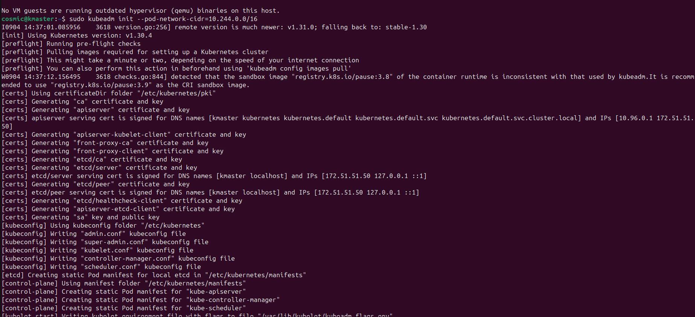
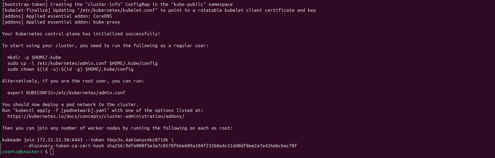
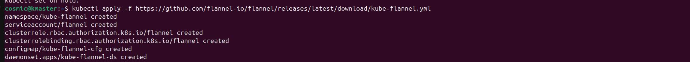
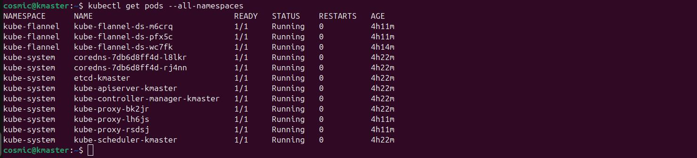
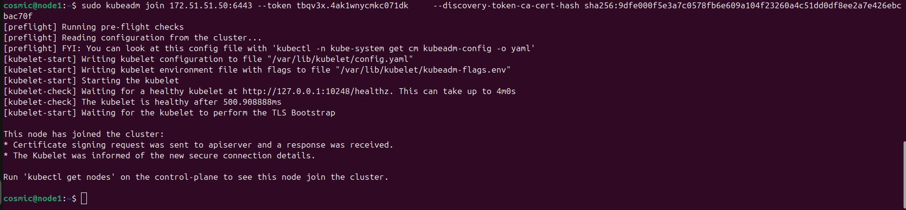
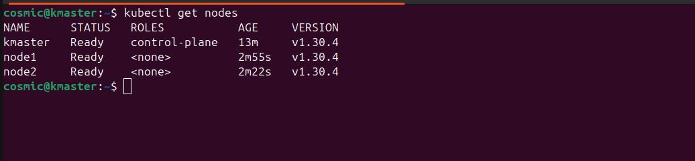

# kubernetes
## Installing kubernetes in Ubuntu 24.04 LTS Server

| Hostname   | IP address  | OS Verion  | RAM | CPU |
|------------|------------|------------|------------|------------|
| kmaster |  172.51.51.50 | Ubuntu 24.04 LTS Server | 4  | 2 |
| node1   |  172.51.51.60 | Ubuntu 24.04 LTS Server | 2  | 2 |
| node2   |  172.51.51.70 | Ubuntu 24.04 LTS Server | 2  | 2 |


#### The following Block 1 & Block 2 & Block 3 & Block 4 is common for all 3 Nodes
#### NOTE : Change / Modify the host_name value when running the following block in different machines

### Block 1 ( Perform the following steps in all 3 Nodes )
```
read -p "Enter the hostname to be set for this computer: " host_name
USER=$(whoami)
if ! sudo grep -q "^$USER ALL=(ALL) NOPASSWD:ALL" /etc/sudoers; then
    echo "$USER ALL=(ALL) NOPASSWD:ALL" | sudo tee -a /etc/sudoers
else
    echo "User $USER is already in sudoers with NOPASSWD."
fi

sudo hostnamectl set-hostname $host_name
sudo timedatectl set-timezone Asia/Kolkata

# check whether Swap is on or not - turn off swap if it is ON

if sudo swapon --show | grep -q .; then
    echo "Swap is active. Turning it off..."
    sudo swapoff -a
    echo "Swap has been turned off."
else
    echo "Swap is already off."
fi

# Turn off swap permanently by commenting the line containing swap in /etc/fstab
sudo sed -i '/swap/s/^/#/' /etc/fstab

# Disable Firewall
sudo ufw disable


sudo groupadd docker
sudo usermod -aG docker $USER
newgrp docker

sudo modprobe overlay
sudo modprobe br_netfilter

sudo tee /etc/modules-load.d/k8s.conf <<EOF
overlay
br_netfilter
EOF

# Kubernetes networking - update the sysctl settings 

sudo tee /etc/sysctl.d/kubernetes.conf <<EOT
net.bridge.bridge-nf-call-ip6tables = 1
net.bridge.bridge-nf-call-iptables = 1
net.ipv4.ip_forward = 1
EOT

```
#### Install Docker (CE) in all the nodes 

#### Follow installation steps given in the followin Docker website

#### Reference : https://docs.docker.com/engine/install/ubuntu/

### Block 2 ( Perform the following steps in all 3 Nodes )

```
# Add Docker's official GPG key:

sudo apt-get update
sudo apt-get install ca-certificates curl -y
sudo install -m 0755 -d /etc/apt/keyrings
sudo curl -fsSL https://download.docker.com/linux/ubuntu/gpg -o /etc/apt/keyrings/docker.asc
sudo chmod a+r /etc/apt/keyrings/docker.asc

# Add the repository to Apt sources:
echo \
  "deb [arch=$(dpkg --print-architecture) signed-by=/etc/apt/keyrings/docker.asc] https://download.docker.com/linux/ubuntu \
  $(. /etc/os-release && echo "$VERSION_CODENAME") stable" | \
  sudo tee /etc/apt/sources.list.d/docker.list > /dev/null
sudo apt-get update

 sudo apt-get install docker-ce docker-ce-cli containerd.io docker-buildx-plugin docker-compose-plugin -y


```

#### Install and Configure Containerd

### Block 3 ( Perform the following steps in all 3 Nodes )

```
sudo apt install -y curl gnupg2 software-properties-common apt-transport-https ca-certificates

sudo curl -fsSL https://download.docker.com/linux/ubuntu/gpg | sudo gpg --dearmour -o /etc/apt/trusted.gpg.d/containerd.gpg 

sudo add-apt-repository "deb [arch=amd64] https://download.docker.com/linux/ubuntu $(lsb_release -cs) stable"

sudo apt update && sudo apt install containerd.io -y

containerd config default | sudo tee /etc/containerd/config.toml >/dev/null 2>&1

sudo sed -i 's/SystemdCgroup \= false/SystemdCgroup \= true/g' /etc/containerd/config.toml

sudo systemctl restart containerd

```

#### Install kubectl kubeadm kubelet

### Block 4 ( Perform the following steps in all 3 Nodes )

#### Reference https://kubernetes.io/docs/tasks/tools/install-kubectl-linux/#install-using-native-package-management

```

curl -fsSL https://pkgs.k8s.io/core:/stable:/v1.30/deb/Release.key | sudo gpg --dearmor -o /etc/apt/keyrings/k8s.gpg

echo 'deb [signed-by=/etc/apt/keyrings/k8s.gpg] https://pkgs.k8s.io/core:/stable:/v1.30/deb/ /' | sudo tee /etc/apt/sources.list.d/k8s.list

sudo apt update && sudo apt install kubelet kubeadm kubectl -y


```

## Intialize the Kubernetes Cluster in master node
#### Run the follwing command in master node to initialize Kubernetes Cluster

```
sudo kubeadm init --pod-network-cidr=10.244.0.0/16

```
#### output for the above command 



#### Cluster Initialized Result


#### The Last screehot shows the message the Kubernetes cluster has been initialized

#### To start using your cluster, you need to run the following as a regular user in the kubernetes master node:

```


  mkdir -p $HOME/.kube
  sudo cp -i /etc/kubernetes/admin.conf $HOME/.kube/config
  sudo chown $(id -u):$(id -g) $HOME/.kube/config

```

#### You should now deploy a pod network to the cluster.
#### Run "kubectl apply -f [podnetwork].yaml" with one of the options listed at:
  https://kubernetes.io/docs/concepts/cluster-administration/addons/

#### Refer the link above there are alot of addons available , i am going to use "flannel" networking in this demo run the following command in the kubernetes master node

```
kubectl apply -f https://raw.githubusercontent.com/coreos/flannel/master/Documentation/kube-flannel.yml

```


#### After the above command run the following command in kubernetes master to view the pods running in 



#### Run the following command on the worker nodes (node1 and node2 in my setup) to join the worker nodes to the kubernetes master / cluster.

#### Refer your output which you got when you initialized the cluster


```
sudo kubeadm join 172.51.51.50:6443 --token tbqv3x.4ak1wnycmkc071dk \
	--discovery-token-ca-cert-hash sha256:9dfe000f5e3a7c0578fb6e609a104f23260a4c51dd0df8ee2a7e426ebcbac70f 

```



#### After running the above command in node1 and node2 , run the following command in kubernetes master

```
kubectl get nodes
```



#### Kubernetes cluster hasbeen configured and node1 and node2 has been joined to the cluster.


