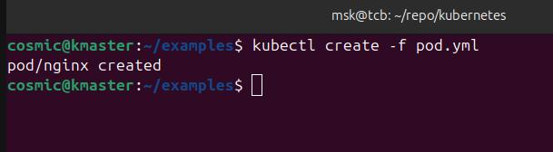

### Create a file named  pod.yml
```
apiVersion: v1
kind: Pod
metadata:
  name: nginx
spec:
  containers:
  - name: nginx
    image: nginx:1.14.2
    ports:
    - containerPort: 80

```

### Run the following command to create a pod in your kubernetes cluster

```
kubectl apply -f pod.yml 

```
